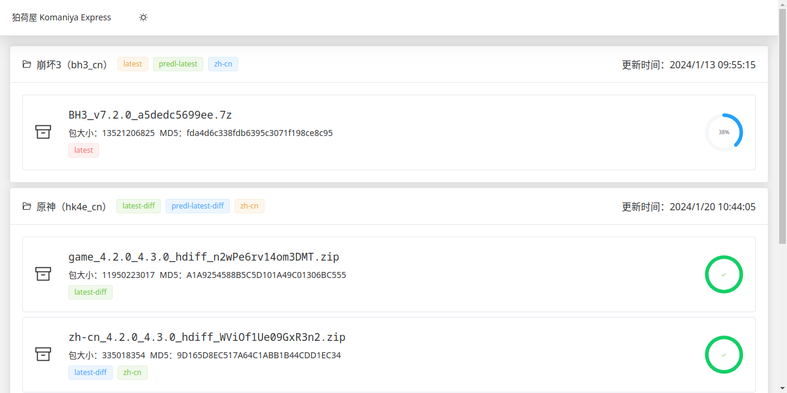

# 狛荷屋 Komaniya Express (Sketch, Element Plus)

使用 [Vue.js](https://cn.vuejs.org/) + [Element Plus](https://element-plus.org/) 搭建的[绮良良 Kirara](https://github.com/AetherIsland/kirara) 的实验性前端。使用了 [element-plus-vite-starter](https://github.com/element-plus/element-plus-vite-starter) 作为项目模板。

