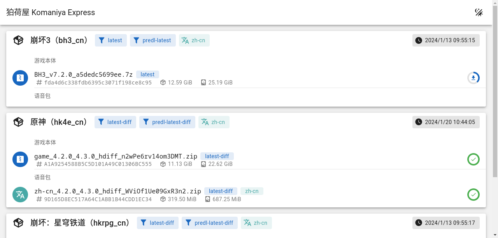

# 狛荷屋 Komaniya Express (Sketch, Vuetify)

使用 [Vue.js](https://cn.vuejs.org/) + [Vuetify](https://vuetifyjs.com/) 搭建的[绮良良 Kirara](https://github.com/AetherIsland/kirara) 的实验性前端。使用了 `pnpm create vuetify` 作为项目模板。看起来比 Element Plus 搭建的好看一点。

